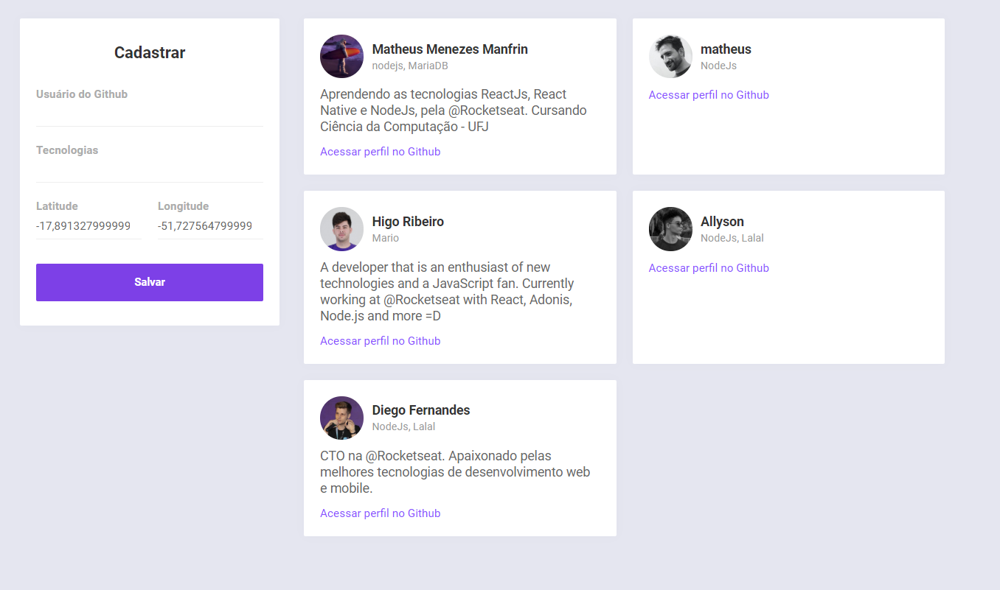
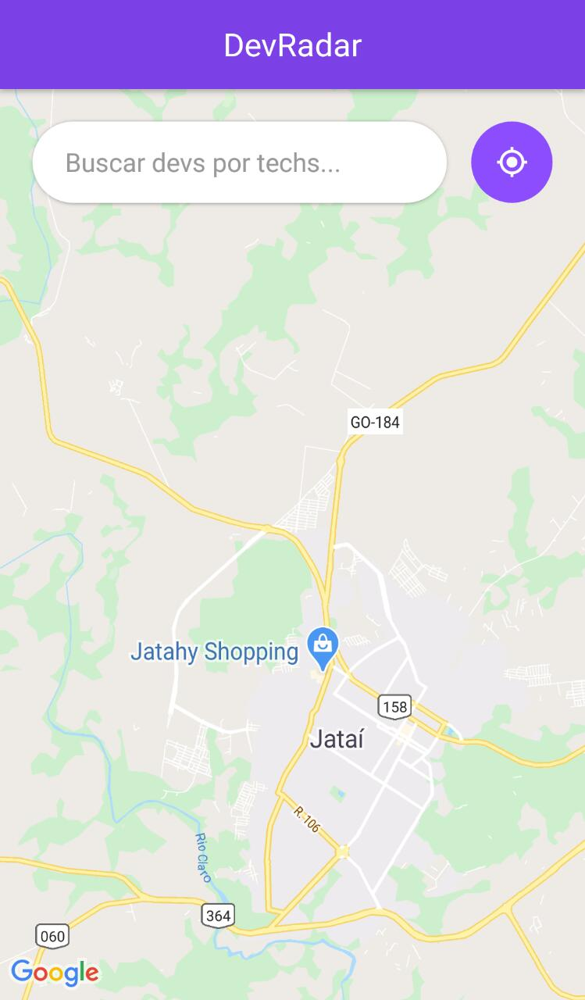
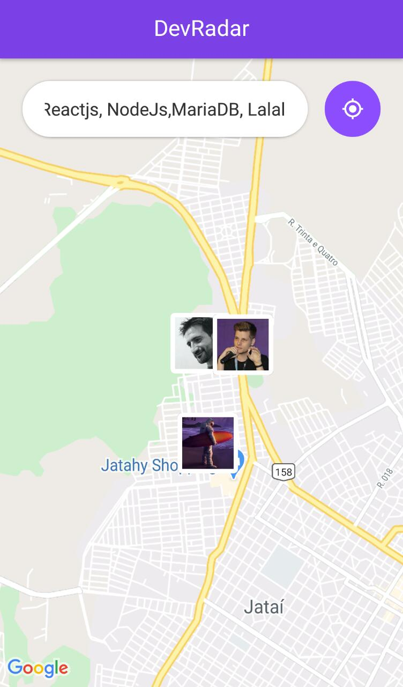
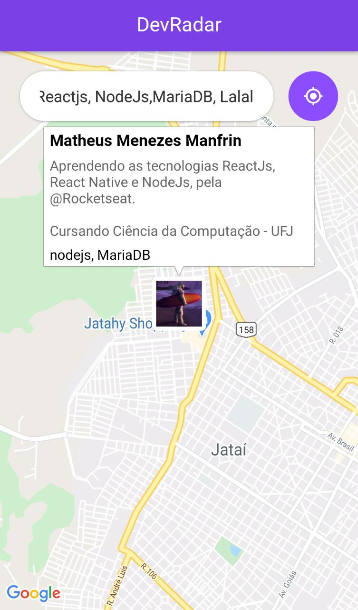

  <h1> DevRadar </h1>

This project was developed at 🚀 OmniStack 10

 
 

  

    
  

  
  
  

## 🚀 Technologies

This app features all the latest tools and practices in web development!

Server

- [NodeJs](https://nodejs.org/)
- [Express](https://expressjs.com/)
- [mongoose]()
- [socket.io]()

---

Web - Initialized with React CRA

- [React]()
- [Axios]()

---

Mobile

- [Axios]()
- [Expo]()
- [expo-location]()
- [React Native]()
- [react-native-maps]()
- [socket.io-client]()

---

All Projects has Prettier and ESLint configured
